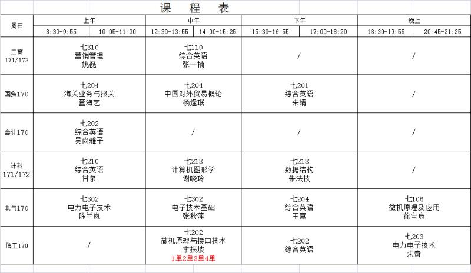

##### 微信中打开假如不能下载请点击右上角在浏览器中打开

#### 重要！！！
- [学位英语报名 3月9日～3月12日 每年仅一次报考机会 四级没过的同学务必报名](https://mp.weixin.qq.com/s/qmuDG13EIkLdq1PbdA-8ZQ)
- [开学3周前提交重修申请、免考申请、学籍变动申请](2018-first-half/apply/apply.md)
- [综合英语需要自行购买](2018-first-half/attachment/自行购买综合英语.jpg)
- [计科172补考时间](2018-first-half/补考时间.jpeg)

#### 课程表


#### 近期事务
- [2017年下半年校内班级补考安排.pdf](2018-first-half/2017年下半年校内班级补考安排.pdf)
- 本周日3月11日开学, 开学当天7:30-15:00凭身份证或学生证去教材中心领书，当天未能领取可在3月17、18日领取
- 本学期远程课学习从3月21日开始，请提醒同学们3月21日后抓紧时间学习
- [全国计算机等级考试报名](https://mp.weixin.qq.com/s/oJ9d8Pscy1j_F-hkigG_fA)

#### 相关符件
- [单双周日历表-单周后两节上听力课](2018-first-half/attachment/单双周日历表.jpg)
- [计科172课程安排](2018-first-half/班级课程表.png)
- [听力上课安排一览](2018-first-half/attachment/听力上课安排一览.jpg)
- [计科172书单](2018-first-half/attachment/书单.jpg)
- [计科172书费扣款成功名单](2018-first-half/attachment/扣书成功名单.jpg)
- [2018年学位英语考试报名通知.docx](2018-first-half/2018年学位英语考试报名通知.docx)
- [学号查询](attachment/xuehao.png)
  
#### 历史文档
- [2017年下学期](2017-second-half.md)
- [2017年上学期](2017-first-half.md)

#### 帮助
- [md文档编写帮助](github-pages-help.md)

每个人都可以修改此文档
```
git clone git@github.com:ecust-cst2017/ecust-cst2017.github.io.git
```
or
```angular2html
git clone https://github.com/ecust-cst2017/ecust-cst2017.github.io.git
```