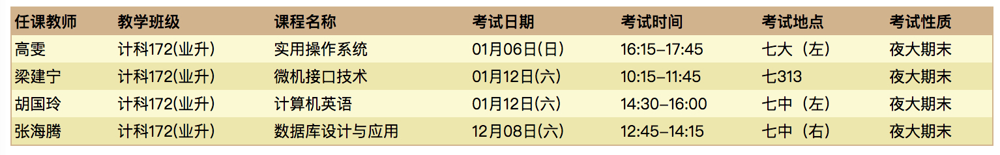

##### 微信中打开假如不能下载请点击右上角在浏览器中打开

#### 考试及实验报告

##### 考试时间



##### 微机接口 01月12日（周六） 10：15-11：45 七313  开卷

- [《微机接口技术》复习要点.doc 老师发](http://openpublic.oss-cn-shanghai.aliyuncs.com/2018-jxjy/%E5%BE%AE%E6%9C%BA%E6%8E%A5%E5%8F%A3/%E3%80%8A%E5%BE%AE%E6%9C%BA%E6%8E%A5%E5%8F%A3%E6%8A%80%E6%9C%AF%E3%80%8B%E5%A4%8D%E4%B9%A0%E8%A6%81%E7%82%B9.doc)
- [微机接口技术PPT.zip](http://openpublic.oss-cn-shanghai.aliyuncs.com/2018-jxjy/%E5%BE%AE%E6%9C%BA%E6%8E%A5%E5%8F%A3/%E5%BE%AE%E6%9C%BA%E5%8E%9F%E7%90%86PPT.zip)

##### 计算机英语 01月12日（周六） 14：30-16：00  七中（左） 半开卷

- 计算机英语考试范围: 所有章节的SectionA习题; 二，三，四部分; 半开卷考试可以带1张A4纸 (有问题可以发邮件给英语老师：邮箱是linder@ecust.edu.cn)
- [计算机英语课后答案（老师发）rar](http://openpublic.oss-cn-shanghai.aliyuncs.com/2018-jxjy/Exam/%E8%AE%A1%E7%AE%97%E6%9C%BA%E8%8B%B1%E8%AF%AD%E8%AF%BE%E5%90%8E%E7%AD%94%E6%A1%88.rar)
- [计算机英语课后答案（老师发）docx](http://openpublic.oss-cn-shanghai.aliyuncs.com/2018-jxjy/%E8%AE%A1%E7%AE%97%E6%9C%BA%E8%8B%B1%E8%AF%AD/%E8%AE%A1%E7%AE%97%E6%9C%BA%E8%8B%B1%E8%AF%AD%E8%AF%BE%E5%90%8E%E9%A2%98%E7%AD%94%E6%A1%88-%E8%80%81%E5%B8%88%E5%8F%91.docx)
- [计算机英语课后答案（百度文库下载）doc](http://openpublic.oss-cn-shanghai.aliyuncs.com/2018-jxjy/%E8%AE%A1%E7%AE%97%E6%9C%BA%E8%8B%B1%E8%AF%AD/%E8%AE%A1%E7%AE%97%E6%9C%BA%E8%8B%B1%E8%AF%AD%E8%AF%BE%E5%90%8E%E9%A2%98%E7%AD%94%E6%A1%88-%E7%99%BE%E5%BA%A6%E6%96%87%E5%BA%93%E4%B8%8B%E8%BD%BD.doc)
- [答案整理A4两面pdf-徐乐](http://openpublic.oss-cn-shanghai.aliyuncs.com/2018-jxjy/%E8%AE%A1%E7%AE%97%E6%9C%BA%E8%8B%B1%E8%AF%AD/%E8%8B%B1%E8%AF%AD%E7%AD%94%E6%A1%882%E9%A1%B5.pdf)
- [答案整理A4三面pdf-徐乐](http://openpublic.oss-cn-shanghai.aliyuncs.com/2018-jxjy/%E8%AE%A1%E7%AE%97%E6%9C%BA%E8%8B%B1%E8%AF%AD/%E8%8B%B1%E8%AF%AD%E7%AD%94%E6%A1%883%E9%A1%B5.pdf)

- [计算机英语课后题目pdf](http://openpublic.oss-cn-shanghai.aliyuncs.com/2018-jxjy/%E8%AE%A1%E7%AE%97%E6%9C%BA%E8%8B%B1%E8%AF%AD/%E8%AE%A1%E7%AE%97%E6%9C%BA%E8%8B%B1%E8%AF%AD%E8%AF%BE%E5%90%8E%E9%A2%98.pdf)
- [计算机英语课后题目pptx](http://openpublic.oss-cn-shanghai.aliyuncs.com/2018-jxjy/%E8%AE%A1%E7%AE%97%E6%9C%BA%E8%8B%B1%E8%AF%AD/%E8%AE%A1%E7%AE%97%E6%9C%BA%E8%8B%B1%E8%AF%AD%E8%AF%BE%E5%90%8E%E9%A2%98.pptx)

##### 操作系统 01月06日（周日） 16：15-17：45    七大（左） 半开卷
- [操作系统复习资料（老师发）](http://openpublic.oss-cn-shanghai.aliyuncs.com/2018-jxjy/%E6%93%8D%E4%BD%9C%E7%B3%BB%E7%BB%9F/2018%E5%B9%B4%E4%B8%8B%E5%8D%8A%E5%B9%B4%E6%93%8D%E4%BD%9C%E7%B3%BB%E7%BB%9F%E5%A4%8D%E4%B9%A0.doc)
- [操作系统复习资料（老师发）缩小版 可打印A4](http://openpublic.oss-cn-shanghai.aliyuncs.com/2018-jxjy/%E6%93%8D%E4%BD%9C%E7%B3%BB%E7%BB%9F/2018%E5%B9%B4%E4%B8%8B%E5%8D%8A%E5%B9%B4%E6%93%8D%E4%BD%9C%E7%B3%BB%E7%BB%9F%E5%A4%8D%E4%B9%A0%E7%BC%A9%E5%B0%8F.doc)
- [操作系统复习资料-梅园浩有道云笔记](https://note.youdao.com/share/index.html?id=aa07ef0371f6ff8a0ae6a91cc0e395c0&type=note#/)
- [邱怡整理A4正面](http://openpublic.oss-cn-shanghai.aliyuncs.com/2018-jxjy/%E6%93%8D%E4%BD%9C%E7%B3%BB%E7%BB%9F/%E9%82%B1%E6%80%A1%E6%95%B4%E7%90%86A4%E6%AD%A3%E9%9D%A2.jpg)
- [邱怡整理A4反面](http://openpublic.oss-cn-shanghai.aliyuncs.com/2018-jxjy/%E6%93%8D%E4%BD%9C%E7%B3%BB%E7%BB%9F/%E9%82%B1%E6%80%A1%E6%95%B4%E7%90%86A4%E5%8F%8D%E9%9D%A2.jpg)

- [PPT第1章](http://openpublic.oss-cn-shanghai.aliyuncs.com/2018-jxjy/%E6%93%8D%E4%BD%9C%E7%B3%BB%E7%BB%9F/chapter1.ppt)
- [PPT第2章](http://openpublic.oss-cn-shanghai.aliyuncs.com/2018-jxjy/%E6%93%8D%E4%BD%9C%E7%B3%BB%E7%BB%9F/chapter2.ppt)
- [PPT第3章](http://openpublic.oss-cn-shanghai.aliyuncs.com/2018-jxjy/%E6%93%8D%E4%BD%9C%E7%B3%BB%E7%BB%9F/chapter3.ppt)

- [操作系统实验内容](http://openpublic.oss-cn-shanghai.aliyuncs.com/2018-jxjy/Task/%E6%93%8D%E4%BD%9C%E7%B3%BB%E7%BB%9F%E5%AE%9E%E9%AA%8C%E5%86%85%E5%AE%B9.doc)
- [操作系统实验报告模板](http://openpublic.oss-cn-shanghai.aliyuncs.com/2018-jxjy/Task/%E3%80%8A%E6%93%8D%E4%BD%9C%E7%B3%BB%E7%BB%9F%E3%80%8B%E5%AE%9E%E9%AA%8C%E6%8A%A5%E5%91%8A.doc)

- [梅园浩实验报告1 供参考](http://openpublic.oss-cn-shanghai.aliyuncs.com/2018-jxjy/%E6%93%8D%E4%BD%9C%E7%B3%BB%E7%BB%9F/%E6%A2%85%E5%9B%AD%E6%B5%A9-%E3%80%8A%E6%93%8D%E4%BD%9C%E7%B3%BB%E7%BB%9F%E3%80%8B%E5%AE%9E%E9%AA%8C%E6%8A%A5%E5%91%8A%EF%BC%881%EF%BC%89.doc)
- [梅园浩实验报告2 供参考](http://openpublic.oss-cn-shanghai.aliyuncs.com/2018-jxjy/%E6%93%8D%E4%BD%9C%E7%B3%BB%E7%BB%9F/%E6%A2%85%E5%9B%AD%E6%B5%A9-%E3%80%8A%E6%93%8D%E4%BD%9C%E7%B3%BB%E7%BB%9F%E3%80%8B%E5%AE%9E%E9%AA%8C%E6%8A%A5%E5%91%8A%EF%BC%882%EF%BC%89.doc)

##### 数据库 12月08日（周六） 12：45-14：15   七中（右） 已结束
- 数据库考试是半开卷，可以携带1张A4纸, 复习范围看考试大纲
- [数据库考试大纲-张老师发-doc](http://openpublic.oss-cn-shanghai.aliyuncs.com/2018-jxjy/Exam/%E7%BB%A7%E7%BB%AD%E6%95%99%E8%82%B2%E6%95%B0%E6%8D%AE%E5%BA%93181%E5%A4%8D%E4%B9%A0%E5%A4%A7%E7%BA%B2.doc)

- [考试资料A4-徐乐-pdf](http://openpublic.oss-cn-shanghai.aliyuncs.com/2018-jxjy/Exam/%E7%BB%A7%E7%BB%AD%E6%95%99%E8%82%B2%E6%95%B0%E6%8D%AE%E5%BA%93181%E5%A4%8D%E4%B9%A0%E5%A4%A7%E7%BA%B2-%E5%BE%90%E4%B9%90%E5%8E%8B%E7%BC%A9.pdf)
- [考试资料A4-徐乐-doc](http://openpublic.oss-cn-shanghai.aliyuncs.com/2018-jxjy/Exam/%E6%95%B0%E6%8D%AE%E5%BA%93-%E5%BE%90%E4%B9%90.doc)

- [考试资料A4-徐乐-梅园浩-25M](http://openpublic.oss-cn-shanghai.aliyuncs.com/2018-jxjy/Exam/%E6%95%B0%E6%8D%AE%E5%BA%93-%E5%BE%90%E4%B9%90-%E6%A2%85%E5%9B%AD%E6%B5%A9.pdf)

- [考试资料A4-邱怡-正面-png](http://openpublic.oss-cn-shanghai.aliyuncs.com/2018-jxjy/Exam/%E6%95%B0%E6%8D%AE%E5%BA%93-%E9%82%B1%E6%80%A1-%E6%AD%A3.png)
- [考试资料A4-邱怡-反面-已更新-png](http://openpublic.oss-cn-shanghai.aliyuncs.com/2018-jxjy/Exam/%E6%95%B0%E6%8D%AE%E5%BA%93-%E9%82%B1%E6%80%A1-%E5%8F%8D-v2.png)

- [考试资料A4-傅佳俊-pdf](http://openpublic.oss-cn-shanghai.aliyuncs.com/2018-jxjy/Exam/%E6%95%B0%E6%8D%AE%E5%BA%93-%E5%82%85%E4%BD%B3%E4%BF%8A-A4.pdf)
- [考试资料A4-傅佳俊-补充](http://openpublic.oss-cn-shanghai.aliyuncs.com/2018-jxjy/Exam/%E6%95%B0%E6%8D%AE%E5%BA%93-%E5%82%85%E4%BD%B3%E4%BF%8A-A4-%E8%A1%A5%E5%85%85.pdf)

- 数据库实验做完的同学发到邮箱：邮箱：zuoyeshiyan@126.com
- 数据库实验内容及模板请到小梅整理的[课堂资料](https://pan.baidu.com/s/1b5cj6Y#list/path=%2F) "03数据库概论目录" 下载

- [武华炎 实验报告参考](http://openpublic.oss-cn-shanghai.aliyuncs.com/2018-jxjy/%E6%95%B0%E6%8D%AE%E5%BA%93/%E6%AD%A6%E5%8D%8E%E7%82%8E-%E8%AE%A1%E7%A7%91171-26170589.zip)
- [张仁元 实验报告参考](http://openpublic.oss-cn-shanghai.aliyuncs.com/2018-jxjy/%E6%95%B0%E6%8D%AE%E5%BA%93/%E5%BC%A0%E4%BB%81%E5%85%83-%E6%95%B0%E6%8D%AE%E5%BA%93%E5%AE%9E%E9%AA%8C%E6%8A%A5%E5%91%8A%E6%A0%BC%E5%BC%8F.doc)

#### 课堂资料
- [课堂资料-百度网盘](https://pan.baidu.com/s/1b5cj6Y#list/path=%2F)

#### 课程表

| 课程名称 |	学时 | 单双周	 | 周学时 | 起始周 | 终止周 | 任课教师 | 上课时间,地点 |
| ------- | ---- | ----- | ----- | ------ | ----- | ------ | ----------- |
| 实用操作系统 | 56 | 单双 | 4 | 1 | 14 | 高雯 | 周六/下午1,2,3,4 七202 |
| 数据库设计与应用	| 48| 单双| 4| 1	| 12| 张海腾| 周六/中午1,2,3,4 七202| 
| 微机接口技术| 64 | 单双 | 4| 1| 16| 	梁建宁| 周六/上午1,2,3,4 七202| 
| 计算机英语| 32 | 单双 | 4| 1| 8| 胡国玲| （远程）| 


  
#### 历史文档
- [2017年下学期](2017-second-half.md)
- [2017年上学期](2017-first-half.md)
- [2018年上学期](2018-first-half.md)

#### 帮助
- [md文档编写帮助](github-pages-help.md)

每个人都可以修改此文档
```
git clone git@github.com:ecust-cst2017/ecust-cst2017.github.io.git
```
or
```angular2html
git clone https://github.com/ecust-cst2017/ecust-cst2017.github.io.git
```