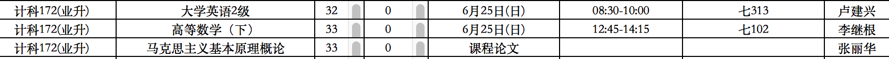

##### 微信中打开假如不能下载请点击右上角在浏览器中打开



#### 高等常数(感谢邱怡同学花费一天的时间整理)
- [A4正面](math/高数1.png)
- [A4反面](math/高数2.png)
- [Ai原版](math/高数.ai)

#### 英语v2(徐彬彬，张仁元，朱志庭等提供)
- [考试要点](english/考试要点.jpg)
- [选择题](english/v2/英语期末A-选择题.docx)
- [完形填空](english/v2/英语期末A-完形填空.docx)
- [阅读理解](english/v2/英语期末A-阅读理解.doc)
- [中译英](english/v2/英语期末A-翻译(中-英)-张仁元提供.docx)
- [英译中](english/v2/英语期末A-翻译(英-中)-徐彬彬提供.docx)
- [百度网盘原始下载链接](http://pan.baidu.com/share/link?shareid=3386488233&uk=523763246)
- [上次版本](english/v1/v1.md)

#### 基础英语二级5套模拟试卷
- [卷1](english/二级模拟试卷/基础英语二级模拟试卷与解析1.doc)
- [卷2](english/二级模拟试卷/基础英语二级模拟试卷与解析2.doc)
- [卷3](english/二级模拟试卷/基础英语二级模拟试卷与解析3.doc)
- [卷4](english/二级模拟试卷/基础英语二级模拟试卷与解析4.doc)
- [卷5](english/二级模拟试卷/基础英语二级模拟试卷与解析5.doc)

#### 帮助
- [md文档编写帮助](github-pages-help.md)

每个人都可以修改此文档
```
git clone git@github.com:ecust-cst2017/ecust-cst2017.github.io.git
```
or
```angular2html
git clone https://github.com/ecust-cst2017/ecust-cst2017.github.io.git
```
