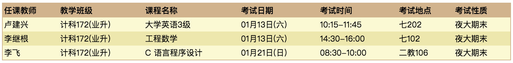

##### 微信中打开假如不能下载请点击右上角在浏览器中打开

#### 近期事务
- [2018年1月8日之前存学费3201到中国银行卡](http://jxjy.ecust.edu.cn/ShowNewsContent.aspx?NewId=3747&pk=153)
- [学生登记表打印](2017-second-half/dayin.jpg)

#### 考试时间


#### 考试资料
- [英语](2017-second-half/english/exam.md)
- [工程数学](2017-second-half/math/exam.md)
- [C语言](2017-second-half/c/exam.md)
- [多媒体](2017-second-half/duomeiti/exam.md)

#### 课堂资料
- [课堂资料-多媒体-高数-英语等-梅园浩不断更新中](https://pan.baidu.com/s/1b5cj6Y#list/path=%2F)
- [CET-4 相关资料](cet4/readme.md)

#### 课程安排
- [2017下半年课程表](2017-second-half/课程表.png)
- [2017年下半年学习日历](2017-second-half/2017年下半年学习日历.doc)
- C语言程序12月17号、31号。两次。时间下午课15：30开始。地点：七教101～面授课！第9周(11月12日）起 单周周日下午3:30~5:00在二教309进行C程序设计远程课程上机实验和辅导答疑。
- 本学期远程学习时间，因故改为11月1日开始，12月31日结束。

#### 相关附件
- [免考申请表](attachment/免考申请表.doc)
- [学籍变动申请表](attachment/学籍变动申请表.doc)
- [非学历证书替代课程-免考一览表](attachment/非学历证书替代课程（免考）一览表.xls)
- [学号查询](attachment/xuehao.png)
- [扣书费成功名单](2017-second-half/扣书费成功名单.jpeg)
- [教材明细](2017-second-half/教材明细.jpeg)

#### 多媒体实验
- [多媒体实验分组 梅园浩整理 点击查看](2017-second-half/多媒体实验分组.jpeg)
- [多媒体实验要求 点击查看](2017-second-half/多媒体实验要求.png)

#### 重修说明
- 重修平台9号-15号专为同学们开放！一重修申请。二查询补考成绩。三打印学生登记表，免修申请表，及需要的表格下载！四请在网络开放时间及时关注学生平台的信息！
- 原定10月7，8日上午及14，15日上午机房报名取消，请通知学生需要重修的在开放时间范围内自行网上报名，然后前往213室确认缴费金额!
- [重修说明请点击此链接](2017-second-half/chongxiu/read.md)
- [重修申请表点击下载](2017-second-half/chongxiu/重修申请表.doc)
  
#### 历史文档
[2017年上学期](2017-first-half.md)

#### 帮助
- [md文档编写帮助](github-pages-help.md)

每个人都可以修改此文档
```
git clone git@github.com:ecust-cst2017/ecust-cst2017.github.io.git
```
or
```angular2html
git clone https://github.com/ecust-cst2017/ecust-cst2017.github.io.git
```